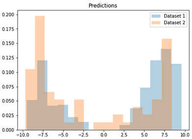

</br>

<h1 align="center">CinnaMon</h1>

</br>

<p align="center">
  <!-- License -->
  <a href="https://opensource.org/licenses/BSD-3-Clause">
    
  </a>
</p>

</br>

<p>
CinnaMon is a Python library which offers a number of tools to detect, explain,
and correct data drift in a machine learning system. At its core, CinnaMon allows to 
study data drift between two given datasets. It is particularly useful in a monitoring 
context where the first dataset is the training (or validation) data and 
the second dataset is the production data.
</p>


## ⚡️ Quickstart

As a quick example, let's illustrate the use of CinnaMon on the breast cancer data 
where we voluntarily introduce some data drift.

### Setup the data and build a model

```python
>>> import pandas as pd
>>> from sklearn import datasets
>>> from sklearn.model_selection import train_test_split
>>> from xgboost import XGBClassifier

# load breast cancer data
>>> dataset = datasets.load_breast_cancer()
>>> X = pd.DataFrame(dataset.data, columns = dataset.feature_names)
>>> y = dataset.target

# split data in train and valid dataset
>>> X_train, X_valid, y_train, y_valid = train_test_split(X, y, test_size=0.3, random_state=2021)

# introduce some data drift in valid by filtering with 'worst symmetry' feature
>>> y_valid = y_valid[X_valid['worst symmetry'].values > 0.3]
>>> X_valid = X_valid.loc[X_valid['worst symmetry'].values > 0.3, :].copy()

# fit a XGBClassifier on the training data
>>> clf = XGBClassifier(use_label_encoder=False)
>>> clf.fit(X=X_train, y=y_train, verbose=10)
```

### Initialize ModelDriftExplainer and fit on train and validation data

```python
>>> from cinnamon.drift import ModelDriftExplainer

# initialize a drift explainer with the built XGBClassifier and fit it on train
# and valid data
>>> drift_explainer = ModelDriftExplainer(model=clf)
>>> drift_explainer.fit(X1=X_train, X2=X_valid, y1=y_train, y2=y_valid)
```

### Detect data drift by looking at main graphs and metrics

```python
# Distribution of logit predictions
>>> drift_explainer.plot_prediction_drift(bins=15)
```

<p align="center">
  
</p>

We can see on this graph that because of the data drift we introduced in validation 
data the distribution of predictions are different (they do not overlap well). We 
can also compute the corresponding drift metrics:

```python
# Corresponding metrics
>>> drift_explainer.get_prediction_drift()
[{'mean_difference': -3.643428434667366,
  'wasserstein': 3.643428434667366,
  'kolmogorov_smirnov': KstestResult(statistic=0.2913775225333014, pvalue=0.00013914094110123454)}]
```

Comparing the distributions of predictions for two dataset is one of the main 
indicator we use in order to detect data drift. The two other indicators are:
- distribution of the target (see `get_target_drift`)
- performance metrics (see `get_performance_metrics_drift`)

### Explain data drift by computing the drift values
Drift values can be thought as equivalent of feature importance but in terms of data drift.

```python
# plot drift values
>>> drift_explainer.plot_tree_based_drift_values(n=7)
```

<p align="center">
  
</p>

See "important notes" below to explore all the functionalities of CinnaMon.


## 🛠 Installation

CinnaMon is intended to work with **Python 3.9 or above**. Installation can be done with `pip`:

```sh
pip install cinnamon
```

You can install the latest development version from GitHub as so:

```sh
pip install git+https://github.com/zelros/cinnamon --upgrade
```

## 🔗 Important notes
- The two main classes of CinnaMon are `ModelDriftExplainer` and `AdversarialDriftExplainer`
- `ModelDriftExplainer` currently only support `XGBoost` models (both regression and classification
  are supported)
- See notebooks in the `examples/` directory to have an overview of all functionalities. 
  Notably:
  - [Covariate shift example with IEEE data](https://github.com/zelros/cinnamon/blob/master/examples/ieee_fraud_simulated_covariate_shift_card6.ipynb)
  - [Concept drift example with IEEE data](https://github.com/zelros/cinnamon/blob/master/examples/ieee_fraud_simulated_concept_drift_card6.ipynb)
    
  These two notebooks also go deeper in the topic of how to correct data drift, making use of `AdversarialDriftExplainer`
- The most recent documentation of this work corresponds to the following [slides](!!!)
- There is no formal documentation for CinnaMon but docstrings are up to date for the two main classes.


## 👍 Contributing

Check out the [contribution](https://github.com/zelros/cinnamon/blob/master/CONTRIBUTING.md) section.

## 📝 License

CinnaMon is free and open-source software licensed under the [3-clause BSD license](https://github.com/zelros/cinnamon/blob/master/LICENSE).
